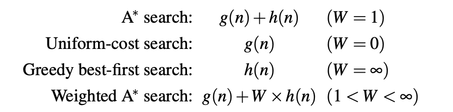
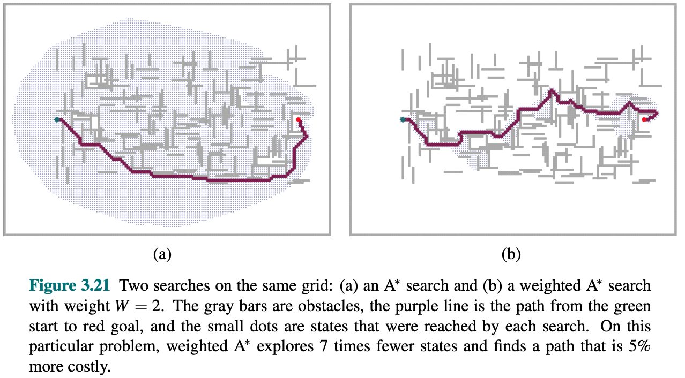

# Exercicios módulo Modelos de Intelixencia Artificial.

## Resolución de problemas mediante búsquedas.

**Fechas de entrega:** A especificar en las sesiones del módulo.

---

## Ejercicio 1

Considérese el problema de encontrar un camino, en la situación representada en la figura, desde la posición $i$ hasta la posición $e$. El NPC (*non-player character*) puede moverse de forma horizontal y vertical, un solo cuadrado en cada movimiento (cada movimiento tiene coste uno). Las zonas sombreadas impiden el paso del NPC a través de ellas.

### Algoritmos a aplicar:

Aplicaremos los distintos algoritmos de búsqueda que se tratan en las sesiones del módulo para resolver el problema, en el siguiente orden:

1. Búsqueda en anchura.
2. Búsqueda en profundidad.
3. Búsqueda de coste uniforme.
4. Algoritmos **A** y **A***.

### Consideraciones:

- Para aquellos algoritmos en los que no es relevante el coste, el orden de los operadores (movimientos) es: **arriba, abajo, izquierda, derecha**.
- Si algún algoritmo no controla los ciclos, supondremos que existen mecanismos para eliminarlos.
- El **coste del movimiento**:
  - **Vertical**: 1.
  - **Horizontal**: 2.
- Para el algoritmo **A** se utilizará la **distancia Manhattan** como heurística:

$$ h(n) = {distancia \ horizontal} + {distancia \ vertical} $$

- En el ejemplo, la distancia Manhattan entre $i$ y $e$ es $4$.

### Preguntas específicas:

1. En la búsqueda en profundidad, el límite de profundidad es 5:
   - Describe qué sucede.
   - Indica el tipo de fracaso (si lo hay).
   - ¿Qué sucede si aumentamos el límite de profundidad a 6?

### Representación de la solución:

- Resuelve el problema con cada uno de los algoritmos de búsqueda propuestos.
- Indica, para cada algoritmo, cuál se aplica para extraer los nodos de la frontera.
- Escribe:
  - La evolución del conjunto de nodos frontera.
  - El conjunto de nodos explorados durante el desarrollo del algoritmo.
  - La función coste y la heurística en los algoritmos que hagan uso de ellas.
- En la figura:
  - Nombra (enumera) los nodos según el orden en que son generados (incluidos en la frontera).
- Indica:
  - Cuándo la función test objetivo determina que el nodo chequeado es la solución.
  - La profundidad en la que se encuentra la solución.
- Razona y explica qué nodos y por qué conforman la solución.
- Representa:
  - El camino que conforma la solución (con una flecha en la figura).
  - El árbol de búsquedas.

---

## Ejercicio 2

### Preguntas específicas:

1. La heurística utilizada en el algoritmo **A**, ¿es admisible? ¿Por qué?
   - ¿Podemos decir que el algoritmo es **A***?

---

## Ejercicio 3

En el hipotético caso de que el servicio Google Maps empleara el algoritmo de **búsqueda por coste uniforme** para encontrar la ruta más corta (en km) entre dos localidades, calcula la solución que ofrecería para la ruta **Ourense-Calatayud** dadas las siguientes distancias kilométricas:

| Trayecto            | Distancia en km      |
| :------------------ | :------------------:|
| Ourense, Ponferrada | 175                 |
| Ourense, Benavente  | 236                 |
| Ponferrada, León    | 113                 |
| Ponferrada, Benavente | 125               |
| Benavente, León     | 75                  |
| Benavente, Valladolid | 112               |
| Benavente, Palencia | 112                 |
| Palencia, León      | 131                 |
| Palencia, Valladolid | 48                 |
| Palencia, Osorno    | 49                  |
| Palencia, Burgos    | 92                  |
| León, Osorno        | 121                 |
| Osorno, Burgos      | 59                  |
| Valladolid, Aranda  | 95                  |
| Burgos, Aranda      | 84                  |
| Aranda, Osma        | 58                  |
| Osma, Calatayud     | 140                 |
| Osma, Soria         | 58                  |
| Burgos, Soria       | 143                 |
| Burgos, Logroño     | 150                 |
| Logroño, Soria      | 106                 |
| Soria, Calatayud    | 91                  |

## Ejercicio 4

Un breve resumen de lo que deberías haber aprendido hasta ahora si has resuelto los ejercicios anteriores:

Figura 3.15 Evaluación de los algoritmos de búsquedas. Russell y Norvig (2022)

Epígrafe 3.5.4 "_Satisficing search: Inadmissible heuristics and weighted A*_". Russell y Norvig (2022)

Figura 3.15 Evaluación de los algoritmos de búsquedas. Russell y Norvig (2022)

## Bibliografía

Russell, S. J., & Norvig, P. (2022). _Artificial intelligence: a modern approach_. Global edition. Pearson Education Limited.
